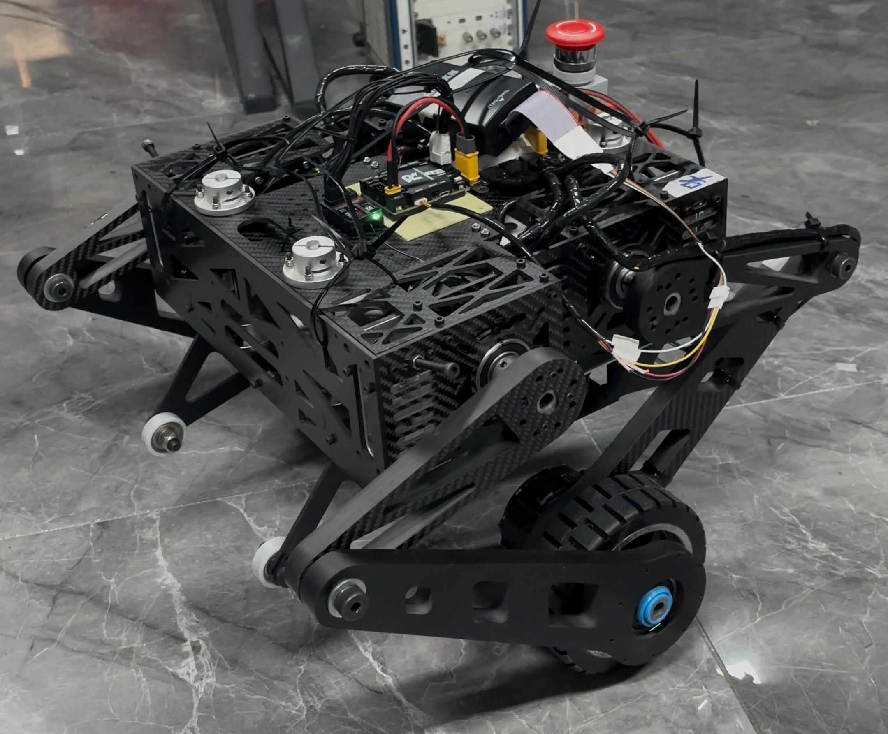

# 轮足机器人  

仍在更新完善。代码部分待继续补充说明。  
## 介绍  
本项目的轮足机器人包含6个电机，4个关节电机及2个轮毂电机均使用SG6010单编码器电机，预留出电池仓及主控螺丝孔位于机体底部。主控使用大疆robomaster C型开发板。  
主控代码部分包含另一个开源的仓库：[电机SDK](https://gitee.com/cyberbeast/mwmotorsdk).

## 目录
整个机器人项目被划分为多个部分，分别存放在仓库的不同目录中，每个部分都有更详细的说明，读者可根据需要进行查阅：  
 
- [`hardware`](hardware)：电源分线板PCB文件，由嘉立创专业版导出包含Gerber和AD文件。  
- [`matlab`](matlab)：算法仿真，包含模型建立、算法设计和仿真文件等。  
- [`software`](software)：主控程序，包含STM32代码工程。  
- [`solidworks`](solidworks)：机械结构设计，包含所有零件和总装配体模型文件。 
  
## 关于我们
北京守护兽科技有限公司是一家致力于电机驱动的技术公司，专注于伺服电机驱动板的研究与开发。本开源项目体现了我们对技术分享与社区建设的承诺，欢迎大家提出建议，共同完善和发展轮足机器人技术。
如需技术支持或合作，请联系： luoyongheng@cyberbeast.cn  

## 特别鸣谢  
感谢西格传动对本项目的大力支持。  
[西格传动官网](https://www.siggear.cn/)  

## 开源协议  
本项目采用 GNU 通用公共许可证 v3.0（GPL-3.0） 开源协议发布。你可以自由使用、修改和分发本项目的源代码，但请遵守以下条款：  

- 如果你修改了本项目的代码并发布，必须在发布的代码中包含原作者信息。  
- 发布的衍生作品必须在相同的GPL-3.0协议下发布。  
- 你在使用本项目时，如果与其他代码一起分发，必须将所有源代码公开。  
详细协议内容请参考[LICENSE](LICENSE)。  

***DRIVE THE WORLD WITH CYBERBEAST*** 