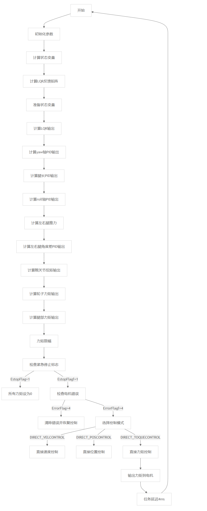

# 轮足主控部分  
本代码基于[Esp32WheelLeg](https://github.com/GodsheepYao/Esp32WheelLeg/tree/ChangeTest/esp32-controller/software)进行开发，再次感谢[Skythinker616](https://github.com/Skythinker616)大佬的开源。  
## 说明
本项目主控采用大疆RoboMaster开发板 C 型作为主控板，使用FREERTOS实时系统进行开发；使用板载陀螺仪BMI088;遥控器使用HOT-RC HT-6A遥控器。  
  
  
  
## 硬件连接  
六个电机通过分线板连接到一条总线上，通过分线板再连接到主控板上。其中电机CAN ID的编号如下：  
  
## 陀螺仪安装方式  
本程序陀螺仪的安装位置和机械预留安装孔的位置不一样，具体安装位置如下（线有些乱-_-||）：  

## 程序框图  

主程序框图
