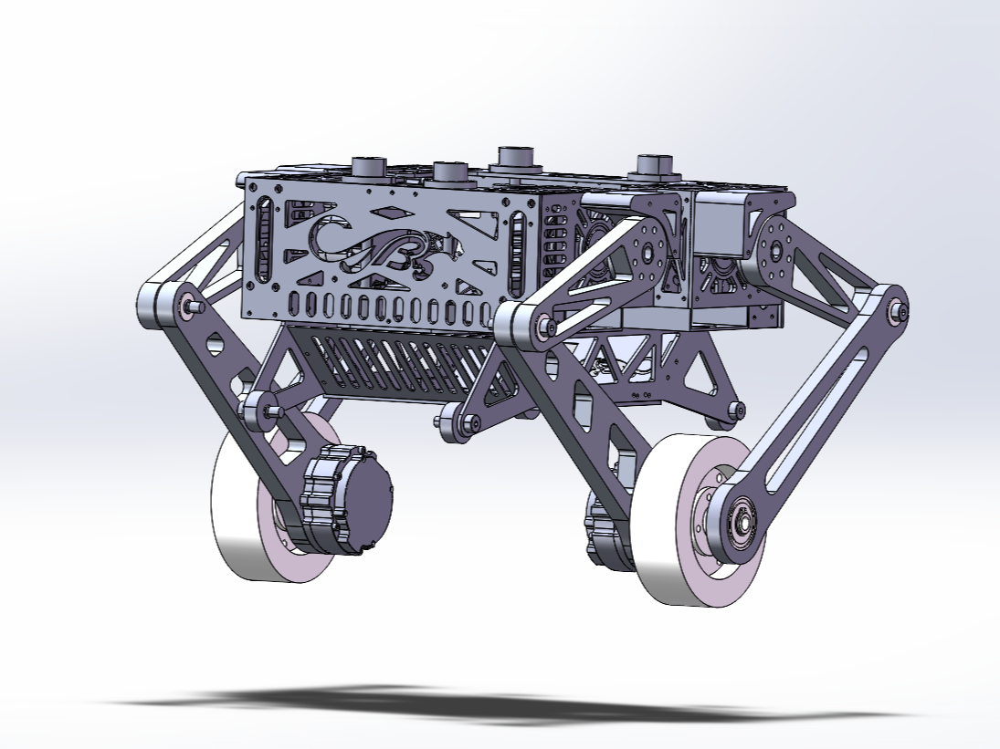
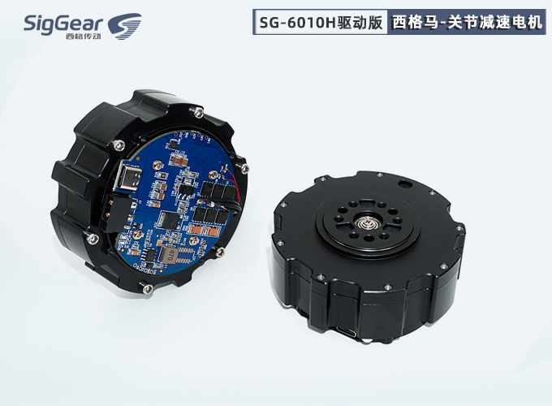
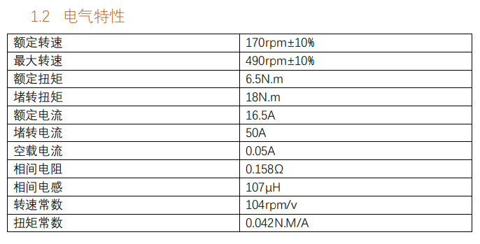
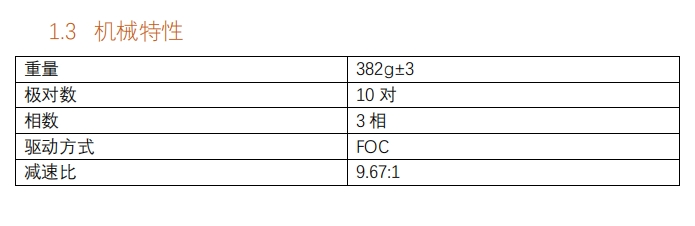
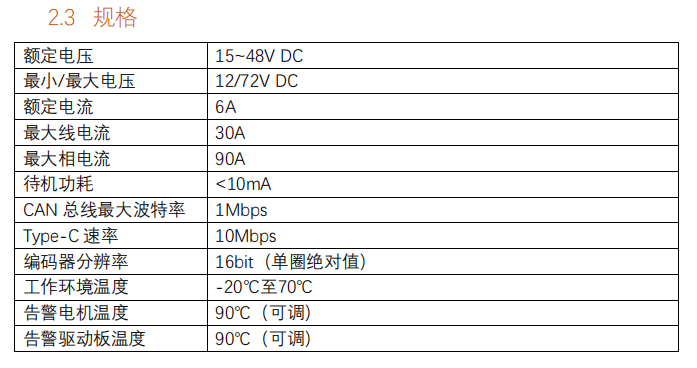
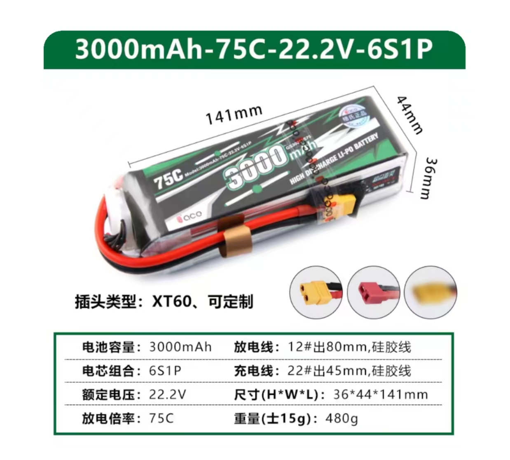

# SolidWorks 机械模型  
  
本模型使用SolidWorks 2020 SP5.0设计，可使用玻纤和碳板作为机体主要材料，关节限位使用3D打印制造。  
本目录中装配图文件中的```轮腿总装配体（开源）```文件若出现打开后无法正常显示机体的情况，请按如图操作。  
  

### 电机选择  
  
关节及轮毂电机均选择SG6010电机，电机参数如下：  
| 电机 | 额定电压 | 堵转扭矩 | 重量 | 购买链接 |
| :--: | :--: | :--: | :--: | :--: |
| SG6010 | 15V-48V DC | 18Nm | 385g | [西格传动](https://www.siggear.cn/product/341.html) |  

  


### 电池
电池选用格氏3000mah 24V 75C锂电池，参数如图：  


## 其他零件  
其他零件购买链接及价格数量在本目录下的excel文件中。  
零件详单：[轮腿零件详单](轮足零件详单.xlsx)